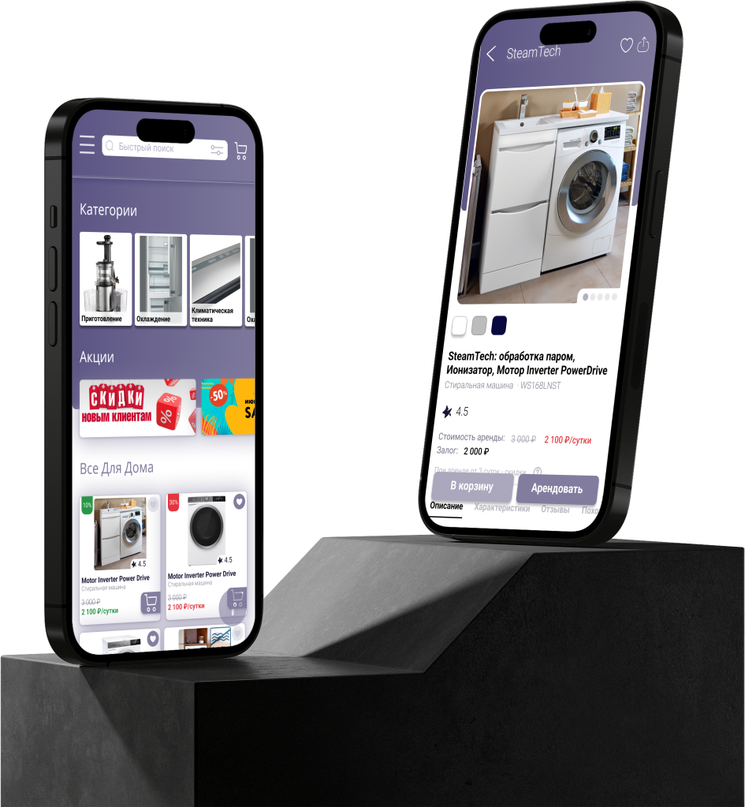
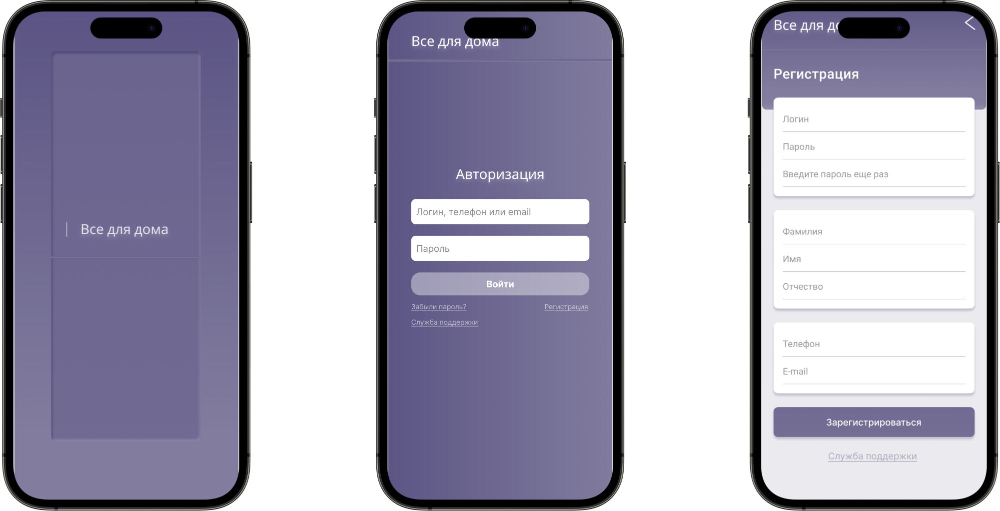
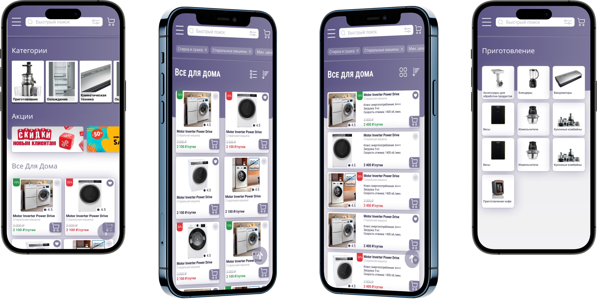
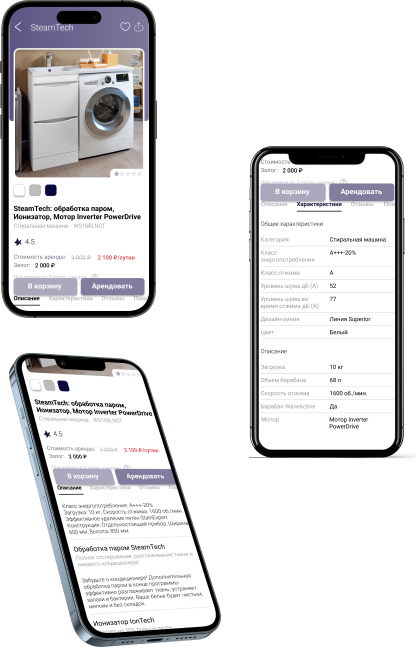
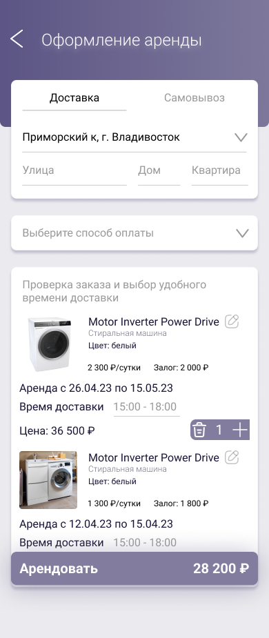

# Дизайн проект
# Мобильное приложение для аренды бытовой техники
___
## О проекте

  Проект UI/UX для приложения аренды бытовой техники - это инновационное решение для людей, которые хотят воспользоваться бытовой техникой без ее покупки. 
  
  Приложение предлагает удобный интерфейс и простой процесс аренды для пользователей, которые могут выбрать нужный продукт и совершить аренду в несколько кликов.

---

## Страницы приложения
При запуске приложения нас встречает стартования страница.
  

  
 Если пользователь не авторизован идет переход на страницу авторизации.
  
Страница авторизации и регистрации имеет простой и интуитивный дизайн для удобства пользователей. 
  
На странице регистрации пользователи могут создать новый аккаунт, указав свои личные данные, такие как имя, фамилия, электронная почта и пароль. 
  На странице авторизации пользователи могут войти в систему, используя свои учетные данные, такие как имя пользователя и пароль. 
  
Эти страницы имеют дружественный пользовательский интерфейс, который обеспечивает безопасность и комфорт при использовании приложения.

---

Главная страница
  

  Главная страница имеет простой и интуитивный дизайн, который позволяет пользователям быстро и легко найти нужный продукт. На главной странице пользователи могут просмотреть список товаров и услуг, а также иметь доступ к другим разделам приложения при помощи кнопки меню, таким как категории товаров, корзина, профиль пользователя и другие.
  

  
Главная страница имеет кнопку поиска, которая позволяет пользователям быстро найти нужный продукт.
 Также пользователь может изменить вид карточек продуктов  в зависимости от предпочтений.
 
 Страница категорий товаров имеет список категорий товаров, которые пользователи могут выбрать для просмотра товаров в определенной категории. На этой странице пользователи могут выбрать нужную категорию, чтобы просмотреть список товаров, соответствующих этой категории.
  

---

 Страницы продуктов
  

  
Страницы продуктов имеют четкое представление о доступных товарах и услугах. На странице выбора продукта пользователи могут просматривать описание, хорактеристики,отзывы и изображения товара, а также его цену и срок аренды. 
  Так же пользователь может добавить товар в корзину,чтобы в будущем арендовать несколько продуктов сразу. И посмотреть свои аренды на соответствующей странице.

---

Страница покупки
  

  
На странице покупки пользователи могут выбрать нужный товар и произвести оплату через приложение. Эти страницы имеют простой и понятный дизайн, который облегчает процесс выбора и покупки товара.
  

## __Вывод:__
Таким образом, мы можем увидеть, что атентификация на двух разных сайтах может быть похожей, но отличаться в некоторых деталях. В основе работы аутентификации пользователей лежит поиск в базе данных записи с логином и паролем. Если же запись не будет найдена, на странице будет выведено сообщение об ошибке авторизации или просто вернет нас на главную страницу сайта, а также вернётся код с ошибкой авторизации.

---

[^1]: [ficbook](https://ficbook.net/)
[^2]: [anime100500](https://anime100500.ru/)
