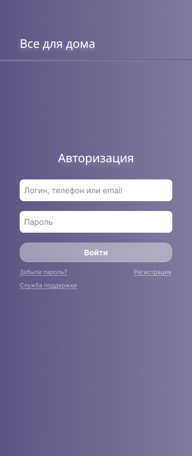
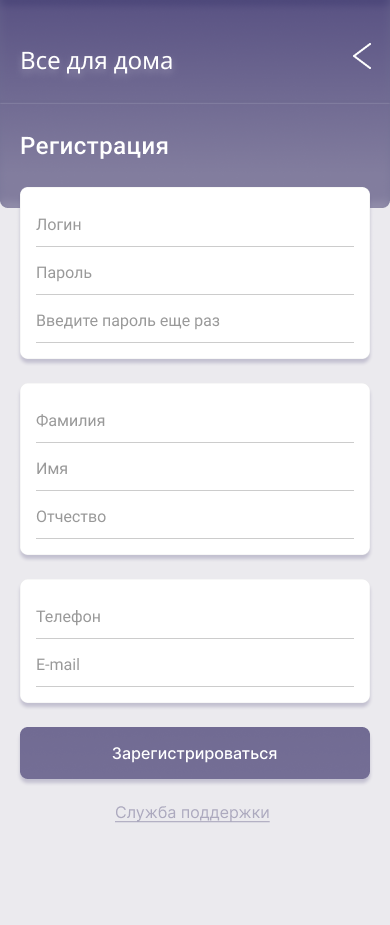
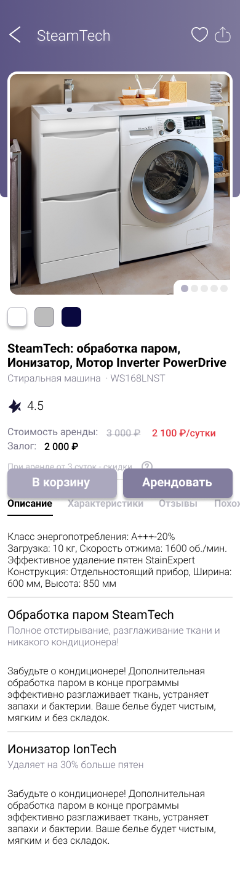
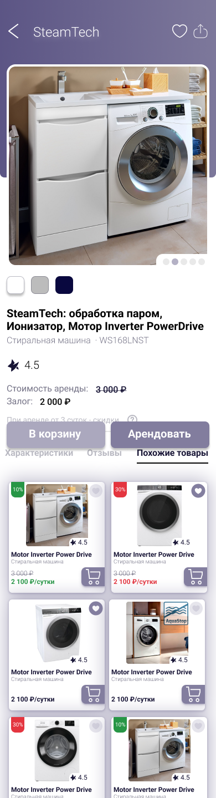
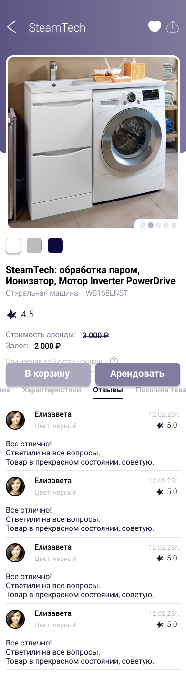
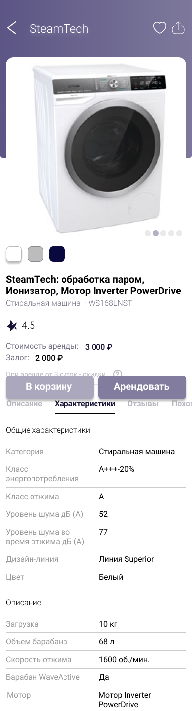

# Дизайн проект
# Мобильное приложение для аренды бытовой техники
___
## О проекте

  Проект UI/UX для приложения аренды бытовой техники - это инновационное решение для людей, которые хотят воспользоваться бытовой техникой без ее покупки. 
  
  Приложение предлагает удобный интерфейс и простой процесс аренды для пользователей, которые могут выбрать нужный продукт и совершить аренду в несколько кликов.

---

## Страницы приложения
При запуске приложения нас встречает стартования страница.
  

  
 Если пользователь не авторизован идет переход на страницу авторизации.

---

Страница авторизации и регистрации имеет простой и интуитивный дизайн для удобства пользователей. 
На странице авторизации пользователи могут войти в систему, используя свои учетные данные, такие как имя пользователя и пароль. 
  

---
На странице регистрации пользователи могут создать новый аккаунт, указав свои личные данные, такие как имя, фамилия, электронная почта и пароль. 
  

---
Эти страницы имеют дружественный пользовательский интерфейс, который обеспечивает безопасность и комфорт при использовании приложения.

---

Главная страница
  
  При переходе на страницу авторизации у нас появляется раздел _loging_check_. 
  Затем, при попытке неверной авторизации, при условии, что у пользователя стоит двухфакторная аутентификация, у нас выполнятся запрос _getrsakey/_ и _dologin/_, а в __From Data__ отображаются введенные данные в разделах _login_ и _password_, а так же отображается пометка _remember: on_, если мы нажали кнопку _запомнить_. При этом, даже, при неудачной авторизации будут выполнены запросы, в ответ на которые сервер вернёт _Status Code: 200_, что говорит нам об успешности запроса.
  

Пример неудачной авторизации
  
 Страницы продуктов имеют четкое представление о доступных товарах и услугах. На странице выбора продукта пользователи могут просматривать описание, хорактеристики,отзывы и изображения товара, а также его цену и срок аренды. 
  

---
На странице покупки пользователи могут выбрать нужный товар и произвести оплату через приложение. Эти страницы имеют простой и понятный дизайн, который облегчает процесс выбора и покупки товара.
  
## __Вывод:__
Таким образом, мы можем увидеть, что атентификация на двух разных сайтах может быть похожей, но отличаться в некоторых деталях. В основе работы аутентификации пользователей лежит поиск в базе данных записи с логином и паролем. Если же запись не будет найдена, на странице будет выведено сообщение об ошибке авторизации или просто вернет нас на главную страницу сайта, а также вернётся код с ошибкой авторизации.

---
[^1]: [ficbook](https://ficbook.net/)
[^2]: [anime100500](https://anime100500.ru/)
